# Sơ đồ dịch chuyển màn hình (Screen Flow Diagram)

## Mô tả
Sơ đồ này mô tả luồng điều hướng giữa các màn hình trong ứng dụng IT4409-Web.

## Sơ đồ luồng màn hình

```mermaid
graph TD
    Start([Khởi động ứng dụng]) --> Login[Màn hình Đăng nhập<br/>/login]
    
    Login -->|Đăng nhập thành công| WorkspaceList[Danh sách Workspace<br/>/workspaces]
    Login -->|Chưa có tài khoản| Register[Màn hình Đăng ký<br/>/register]
    Login -->|Quên mật khẩu| ForgotPassword[Quên mật khẩu<br/>/forgot-password]
    
    Register -->|Đăng ký thành công| Login
    Register -->|Đã có tài khoản| Login
    
    ForgotPassword -->|Gửi email thành công| ResetPassword[Đặt lại mật khẩu<br/>/reset-password]
    ForgotPassword -->|Quay lại| Login
    
    ResetPassword -->|Đặt lại thành công| Login
    
    WorkspaceList -->|Chọn workspace| WorkspaceWelcome[Màn hình chào mừng Workspace<br/>/workspace/:workspaceId]
    WorkspaceList -->|Tạo workspace mới| CreateWorkspaceModal[Modal tạo Workspace]
    WorkspaceList -->|Tham gia workspace| JoinWorkspaceModal[Modal tham gia Workspace]
    WorkspaceList -->|Xem profile| Profile[Trang cá nhân<br/>/profile]
    WorkspaceList -->|Đăng xuất| Login
    
    CreateWorkspaceModal -->|Tạo thành công| WorkspaceList
    JoinWorkspaceModal -->|Tham gia thành công| WorkspaceList
    
    WorkspaceWelcome -->|Chọn channel| ChannelDetail[Chi tiết Channel<br/>/workspace/:workspaceId/channel/:channelId]
    WorkspaceWelcome -->|Tạo channel mới| CreateChannelModal[Modal tạo Channel]
    WorkspaceWelcome -->|Tham gia channel| JoinChannelModal[Modal tham gia Channel]
    WorkspaceWelcome -->|Quản trị workspace| WorkspaceAdmin[Quản trị Workspace<br/>/workspace/:workspaceId/admin]
    WorkspaceWelcome -->|Quay lại| WorkspaceList
    WorkspaceWelcome -->|Xem profile| Profile
    
    CreateChannelModal -->|Tạo thành công| WorkspaceWelcome
    JoinChannelModal -->|Tham gia thành công| WorkspaceWelcome
    
    ChannelDetail -->|Xem tab Chat| ChatTab[Tab Chat - Đăng bài và bình luận]
    ChannelDetail -->|Xem tab Files| FilesTab[Tab Files - Quản lý tệp]
    ChannelDetail -->|Xem tab Meeting| MeetingTab[Tab Meeting - Cuộc họp]
    ChannelDetail -->|Cập nhật channel| UpdateChannelModal[Modal cập nhật Channel]
    ChannelDetail -->|Thêm thành viên| AddMemberModal[Modal thêm thành viên]
    ChannelDetail -->|Xem danh sách thành viên| MembersModal[Modal danh sách thành viên]
    ChannelDetail -->|Xem yêu cầu tham gia| RequestsModal[Modal yêu cầu tham gia]
    ChannelDetail -->|Rời channel| WorkspaceWelcome
    ChannelDetail -->|Quay lại| WorkspaceWelcome
    
    ChatTab --> ChannelDetail
    FilesTab --> ChannelDetail
    MeetingTab --> ChannelDetail
    UpdateChannelModal --> ChannelDetail
    AddMemberModal --> ChannelDetail
    MembersModal --> ChannelDetail
    RequestsModal --> ChannelDetail
    
    WorkspaceAdmin -->|Quản lý thành viên| AdminMembers[Quản lý thành viên Workspace]
    WorkspaceAdmin -->|Quản lý channels| AdminChannels[Quản lý Channels]
    WorkspaceAdmin -->|Cài đặt workspace| AdminSettings[Cài đặt Workspace]
    WorkspaceAdmin -->|Quay lại| WorkspaceWelcome
    
    AdminMembers --> WorkspaceAdmin
    AdminChannels --> WorkspaceAdmin
    AdminSettings --> WorkspaceAdmin
    
    Profile -->|Cập nhật thông tin| ProfileUpdate[Cập nhật thông tin cá nhân]
    Profile -->|Quay lại| WorkspaceList
    ProfileUpdate --> Profile

    style Login fill:#e1f5ff
    style Register fill:#e1f5ff
    style ForgotPassword fill:#e1f5ff
    style ResetPassword fill:#e1f5ff
    style WorkspaceList fill:#fff4e1
    style WorkspaceWelcome fill:#e8f5e9
    style ChannelDetail fill:#f3e5f5
    style Profile fill:#fff3e0
    style WorkspaceAdmin fill:#fce4ec
```

## Mô tả các màn hình chính

### 1. Nhóm Xác thực (Authentication)
- **Đăng nhập** (`/login`): Màn hình đăng nhập với email và mật khẩu
- **Đăng ký** (`/register`): Đăng ký tài khoản mới với thông tin đầy đủ
- **Quên mật khẩu** (`/forgot-password`): Gửi email để đặt lại mật khẩu
- **Đặt lại mật khẩu** (`/reset-password`): Tạo mật khẩu mới sau khi nhận email

### 2. Quản lý Workspace
- **Danh sách Workspace** (`/workspaces`): Hiển thị tất cả workspace mà người dùng tham gia
  - Có thể tạo workspace mới
  - Có thể tham gia workspace bằng mã mời
  - Điều hướng đến profile hoặc đăng xuất

### 3. Workspace
- **Màn hình chào mừng Workspace** (`/workspace/:workspaceId`): Trang chính của workspace
  - Hiển thị danh sách channels
  - Tạo hoặc tham gia channel
  - Truy cập trang quản trị (nếu là admin)

### 4. Channel
- **Chi tiết Channel** (`/workspace/:workspaceId/channel/:channelId`): Màn hình chính để tương tác trong channel
  - **Tab Chat**: Đăng bài viết và bình luận
  - **Tab Files**: Quản lý và chia sẻ tệp
  - **Tab Meeting**: Tổ chức cuộc họp
  - Quản lý thành viên và cài đặt channel

### 5. Quản trị
- **Quản trị Workspace** (`/workspace/:workspaceId/admin`): Trang quản trị dành cho admin
  - Quản lý thành viên workspace
  - Quản lý channels
  - Cài đặt workspace

### 6. Cá nhân
- **Profile** (`/profile`): Trang thông tin cá nhân
  - Xem và cập nhật thông tin
  - Thay đổi avatar

## Luồng người dùng chính

1. **Người dùng mới**:
   - Khởi động → Đăng nhập → Đăng ký → Đăng nhập → Danh sách Workspace

2. **Đăng nhập và làm việc**:
   - Khởi động → Đăng nhập → Danh sách Workspace → Chọn Workspace → Chọn Channel → Làm việc (Chat/Files/Meeting)

3. **Tạo Workspace mới**:
   - Danh sách Workspace → Tạo Workspace → Danh sách Workspace → Chọn Workspace mới

4. **Quản trị Workspace**:
   - Workspace → Quản trị → Quản lý thành viên/channels/cài đặt

5. **Quên mật khẩu**:
   - Đăng nhập → Quên mật khẩu → Nhận email → Đặt lại mật khẩu → Đăng nhập

## Ghi chú
- Tất cả các màn hình (trừ Authentication) yêu cầu người dùng đã đăng nhập
- Nếu chưa đăng nhập, người dùng sẽ được chuyển về trang đăng nhập
- Người dùng có thể truy cập Profile từ nhiều màn hình khác nhau thông qua menu người dùng
